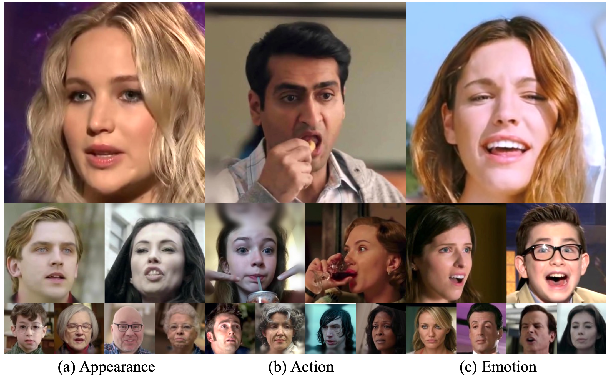
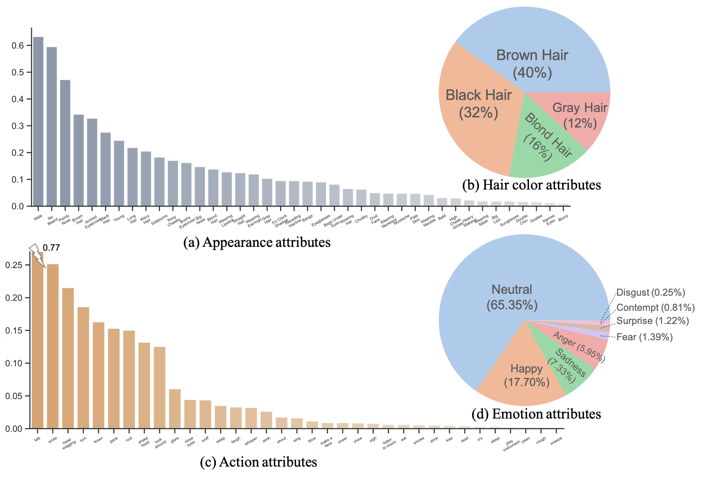

# CelebV-HQ: A Large-Scale Video Facial Attributes Dataset


> Abstract: Large-scale datasets have played indispensable roles in the recent success of face generation/editing and significantly facilitated the advances of emerging research fields. However, the academic community still lacks a video dataset with diverse facial attribute annotations, which is crucial for the research on face-related videos. 
In this work, we propose a large-scale, high-quality, and diverse video dataset with rich facial attribute annotations, named the High-Quality Celebrity Video Dataset (CelebV-HQ). CelebV-HQ contains 35,666 video clips with the resolution of 512x512 at least, involving 15,653 identities. All clips are labeled manually with 83 facial attributes, covering appearance, action, and emotion.
We conduct a comprehensive analysis in terms of age, ethnicity, brightness stability, motion smoothness, head pose diversity, and data quality to demonstrate the diversity and temporal coherence of CelebV-HQ. Besides, its versatility and potential are validated on two representative tasks, i.e., unconditional video generation and video facial attribute editing.
Furthermore, we envision the future potential of CelebV-HQ, as well as the new opportunities and challenges it would bring to related research directions. 


[Hao Zhu*](www.zhuhaozh.xyz), 
[Wayne Wu*](https://scholar.google.com/citations?&user=uWfZKz4AAAAJ), 
[Wentao Zhu](https://wentao.live), 
[Liming Jiang](https://liming-jiang.com/),
[Siwei Tang](mailto:tangsiwei@sensetime.com),
[Li Zhang](mailto:zhangli2@sensetime.com),
[Ziwei Liu](https://liuziwei7.github.io/), 
and [Chen Change Loy](https://www.mmlab-ntu.com/person/ccloy/)<br> <small>(*Equal contribution)</small>

**[Demo Video](https://www.youtube.com/watch?v=8eNUwi34Xp8)** | **[Project Page](https://celebv-hq.github.io/)** | **[Paper (Coming soon)](#)**

# Updates
- [21/6/2022] The codebase and project page are created.

# TODO
- [x] Data download scripts.
- [ ] Inference codes 
- [ ] Pretrained models of unconditional video generation 

# Statistics
The distributions of each attribute. CelebV-HQ has a diverse distribution on each attribute category. Overall, CelebV-HQ contains diverse facial attributes and natural distributions, bringing new opportu -unities and challenges to the community.



  

# Agreement
- The CelebV-HQ dataset is available for non-commercial research purposes only.
- All videos of the CelebV-HQ dataset are obtained from the Internet which are not property of SenseTime Research. The SenseTime Research is not responsible for the content nor the meaning of these videos.
- You agree not to reproduce, duplicate, copy, sell, trade, resell or exploit for any commercial purposes, any portion of the videos and any portion of derived data.
- You agree not to further copy, publish or distribute any portion of the CelebV-HQ dataset. Except, for internal use at a single site within the same organization it is allowed to make copies of the dataset.

# Download
## Usage:


Prepare the environment: 
```bash
pip install youtube_dl
pip install opencv-python
```

Run script: 
```bash
# you can change the download folder in the code 
python download_tools.py
``` 


## JSON File Structure:
```javascript
{
"meta_info": 
    {
        "appearance_mapping": ["Blurry", "Male", "Young", ...],  // appearance attributes
        "action_mapping": ["blow", "chew", "close_eyes", ...]    // action attributes
    },  

"clips": 
{
    "M2Ohb0FAaJU_1":  // clip 1 
    {
        "ytb_id": "M2Ohb0FAaJU",                                   // youtube id
        "duration": {"start_sec": 81.62, "end_sec": 86.17},        // start and end times in the original video
        "bbox": {"top": 0.0, "bottom": 0.8815, "left": 0.1964, "right": 0.6922},  // bounding box
        "attributes":                                              // attributes information
        {
            "appearance": [0, 0, 1, ...],                          // same order as the "appearance_mapping"
            "action": [0, 0, 0, ...],                              // same order as the "action_mapping"
            "emotion": {"sep_flag": false, "labels": "neutral"}    // only one emotion in the clip 
         }, 
         "version": "v0.1"
           
    },
    "_0tf2n3rlJU_0":  // clip 2 
    {
        "ytb_id": "_0tf2n3rlJU", 
        "duration": {"start_sec": 52.72, "end_sec": 56.1}, 
        "bbox": {"top": 0.0, "bottom": 0.8407, "left": 0.5271, "right": 1.0}, 
        "attributes": 
        {
            "appearance": [0, 0, 1, ...], 
            "action": [0, 0, 0, ...], 
            "emotion": 
            {
                "sep_flag": true, "labels": [                      // multi-emotion in the clip
                    {"emotion": "neutral", "start_sec": 0, "end_sec": 0.28}, 
                    {"emotion": "happy", "start_sec": 1.28, "end_sec": 3.28}]
            }
        }, 
        "version": "v0.1" 
    }
    "..."
    "..."

}
```


# Citation
```bibtex
@article{celebvhq,
      title={CelebV-HQ: A Large-scale Video Facial Attributes Dataset},
      author={Zhu, Hao and Zhu, Wentao and Jiang, Liming and Tang, Siwei and 
        Zhang, Li and Liu, Ziwei and Loy, Chen Change and Wu, Wayne},
      journal={arxiv}
    }
```
# Acknowlegement
We sincerely thank Zongcai Sun for his great help in source data preparation and the download tool development.

